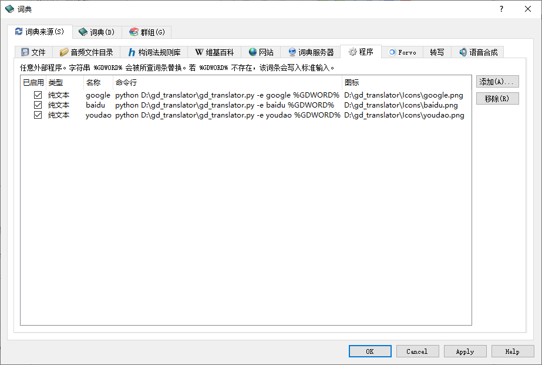

## gd_translator

用于 Goldendict 的翻译脚本

目前调用了 百度、有道、谷歌 的接口，需要自行申请 API

使用方法：

将 `config.example.ini` 重命名为 `config.ini`， 并改为自己的 APIKEY

python 安装相应的库：
```bash
pip install requests
```

Goldendict 配置实例：



